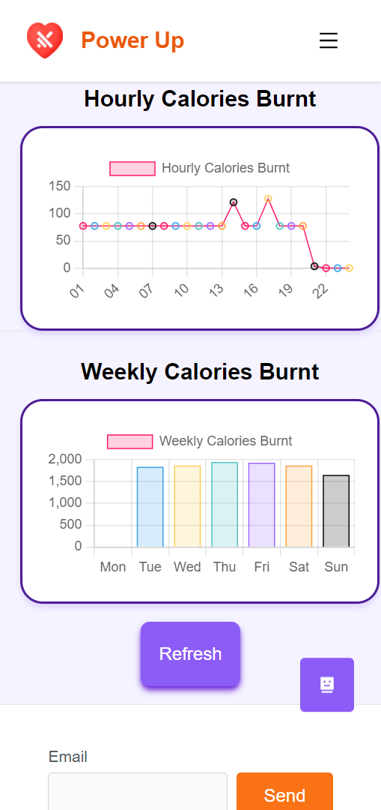
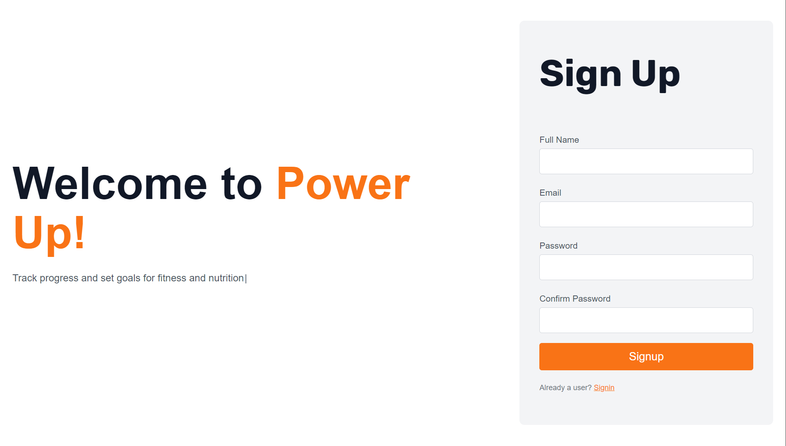

# POWERUP
## Take your health to new heights with Power Up

## Live Website - [PowerUp](https://powerup.sidd065.repl.co/)

## Background
### It is difficult to commit to a fitness routine since it involves a lot of work. Also, people often Google their symptoms of illness and end up jumping to conclusions based on a simple Google search without even consulting a doctor’s advice. But due to our busy lifestyle, it is difficult to visit a doctor for every small symptom. To conquer these problems, we created a Web/App to keep us up-to-date with fitness goals and health check ins.

## Description
### Power Up is a health monitoring and diet tracking app that is compatible with a vast range of smart watches and wearable devices that run Wear OS. Data is easily collected with Google Fitness Intergation for a seamless user experience. Users can keep a track of their weight, steps, calories and also set goals, dietary preference and/or health condition. Based on the details, users can chat with differnt AI based chatbots.

## Features
1. Steps Counter
2. Calories Burnt Tracker
3. Calories Intake Tracker
4. Weight Tracker
5. Goals Setting
6. View Friends Profile
7. Challenge a Friend
8. Redeem Points to buy Merchandise from Store
9. Diet Chat Bot
10. Health Chat Bot
11. Exercise Chat Bot
12. Web Notifications
13. Authenticated Logins
14. Mobile and Web Responsive

## Screenshots

|  |
| :--------------------------------------: |
|              _Landing Page_              |

|  |
| :-------------------------------------: |
|               _Dashboard_               |

|  |
| :---------------------------------------------------------------: |
|                     _Calorie Intake Tracker_                      |

|  |
| :-----------------------------------------------: |
|                 _Weight Tracker_                  |

|  |  |
| :----------------------------------------------------: | :-------------------------------------------------------------: |
|                    _Steps Counter_                     |                    _Calories Burnt Tracker_                     |

|  |
| :-----------------------------------: |
|              _Diet Bot_               |

|  |
| :--------------------------------------: |
|               _Challenges_               |

|  |
| :---------------------------------: |
|              _Friends_              |

|  |
| :-----------------------------------------------: |
|                 _Friend Profile_                  |

|  |
| :-----------------------------: |
|             _Store_             |

|  |
| :-------------------------------: |
|             _Signin_              |

|  |
| :-------------------------------: |
|             _Signup_              |

## Author
<!-- 1. Siddarth Nachane - [contact](https://replit.com/@Sidd065)
2. Aditya Surve - [contact](https://github.com/SurveAditya)
3. Archit Rathod - [contact](https://github.com/Archit1706) -->
Archit Rathod - [GitHub](https://github.com/Archit1706) | [LinkedIn](https://www.linkedin.com/in/archit-rathod/)

